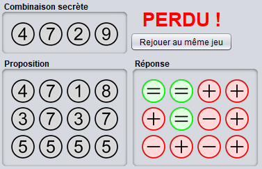
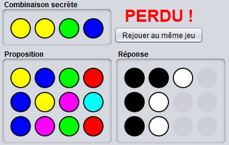

# Guide de compilation et d'utilisation des jeux Recherche +/- et Mastermind

## Présentation du projet

**Contexte**   
Ce projet propose de créer une application proposant des jeux de logique. Plusieurs variantes autour de la recherche de combinaisons secrètes sont à développer :  
- La recherche d'une combinaison à l'aide d'indications +/-  
- Le Mastermind 
 
**Objectif**   
Ce projet consiste à mettre en œuvre les concepts fondamentaux de la programmation orientée-objet en Java.

## Installation et exécution du projet

### Environnement d'exécution
**JavaSE-1.8**  
**jre1.8.0_201**

### Présentation de l'arborescence du projet
**bin** : fichiers compilés (.class, excécutable .jar)  
**doc** : documentation (.pdf)  
**javadoc** : documentation du code (.html)  
**lib** : librairies (Apache Common Lang, log4j)  
**logs** : fichiers des logs (.log)  
**src** : sources (.java, .properties, .xml, .html, images)  

### Exécution du projet

#### Mode normal

Placez-vous en ligne de commande dans le répertoire **"bin"** et taper la commande :  

**java -jar jeux-de-logique-0.0.1.jar**  

Après le lancement, une fenêtre graphique Swing s'ouvre pour permettre de jouer aux jeux.  

#### Mode développeur

Un mode développeur peut être activé par le passage d'un paramètre au lancement de l'application.  
Placez-vous en ligne de commande dans le répertoire **"bin"** et taper la commande :  

**java -jar jeux-de-logique-0.0.1.jar 1**  

Après le lancement, une fenêtre graphique Swing s'ouvre pour permettre de jouer aux jeux dans lesquels la solution est affichée dès le départ.  

### Règles des jeux

#### Recherche +/-

**But**  
Le but du Recherche +/- est de découvrir la combinaison à x chiffres de l'adversaire (le défenseur). Pour ce faire, l'attaquant fait une proposition. Le défenseur indique pour chaque chiffre de la combinaison proposée si le chiffre de sa combinaison secrète est plus grand (+), plus petit (-) ou si c'est le bon chiffre (=).  
L'attaquant doit deviner la combinaison secrète en un nombre limité d'essais.  

**Exemple**  
Les pions **"+"** indiquent le chiffre de la combinaison secrète est **plus grand** que celui de la proposition.  
Les pions **"-"** indiquent le chiffre de la combinaison secrète est **plus petit** que celui de la proposition.  
Les pions **"="** indiquent le chiffre de la combinaison secrète est **égal** à celui de la proposition.  

#### Mastermind

**But**  
Le but du Mastermind est de découvrir la combinaison secrète à x couleurs de l'adversaire (le défenseur). Pour ce faire, l'attaquant fait une proposition de couleurs. Le défenseur indique pour chaque proposition le nombre de couleur de la proposition qui apparaissent à la bonne place et à la mauvaise place dans la combinaison secrète.  
L'attaquant doit deviner la combinaison secrète en un nombre limité d'essais.  

**Exemple**  
Les pions **noirs** indiquent le nombre de couleurs qui sont **bien placées**.  
Les pions **blancs** indiquent le nombre de couleurs qui sont **mal placées**.  

